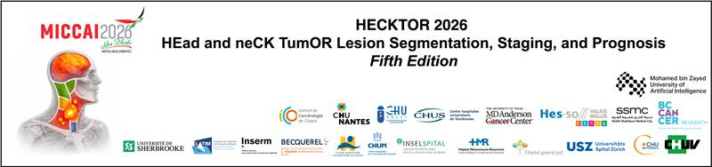

# HECKTOR2026 - Challenge

<p align="center">
  
</p>

Welcome to the **HECKTOR 2026 Challenge** repository! This repository contains instructions and examples for creating a baseline and a valid Docker container for the [HECKTOR 2026 Challenge](TBA). It will also help you understand how to submit your designed model to [Grand Challenge](https://grand-challenge.org/) for evaluation. Here you'll find everything you need to get started quickly: from understanding the challenge, to setting up your environment, training your first model, and evaluating your results. This repository has **two primary branches**:

- [**main**](https://github.com/BioMedIA-MBZUAI/HECKTOR2026/tree/main): Step-by-step guides, data loaders, training scripts, and inference examples so you can get a working model up and running quickly.

- [**docker-template**](https://github.com/BioMedIA-MBZUAI/HECKTOR2026/tree/docker-template): Designed for containerizing and submitting your final models to Grand Challenge. This branch provides a Docker-based inference template, build/test/save scripts, and enforces all challenge restrictions.

---

# How can this Repo help?

1. Understand what the challenge is about
2. Set up your development environment
3. Train models on our provided data
4. Test and evaluate your results
5. Explore ideas for improving performance

---

# 🚀 About the HECKTOR'26 Challenge

Head and Neck (H&N) malignancies constitute a major oncological burden globally, ranking seventh in terms of incidence and occurring more frequently in men and older individuals [Barsouk et al. 2023]. The combination of radiotherapy and cetuximab is currently regarded as a standard therapeutic approach [Bonner et al. 2010]. Nevertheless, disease control at the primary and regional sites remains problematic, with locoregional relapse reported in up to 40% of patients within two years of treatment completion [Chajon et al. 2013]. PET and CT capture distinct yet complementary aspects of tumor biology — metabolic activity and anatomical structure, respectively — providing synergistic information for lesion delineation and for characterizing tumor features that may be predictive of clinical outcomes.

Following the success of previous HECKTOR editions (2020–2025), the **2026 edition introduces a unified, end-to-end pipeline** that jointly addresses segmentation, TN staging, and prognosis for head and neck cancer patients. Unlike prior editions where tasks were treated independently, this framework models the dependency between tasks, closely reflecting real-world clinical decision-making and aligning with the MICCAI 2026 theme of **clinical translation**.

The challenge will be presented at [MICCAI 2026](https://hecktor26.grand-challenge.org). The dataset comprises approximately **1,423 patient cases** from 11+ centers across Canada, Europe, the USA, and the UAE.

---

## The Task: End-to-End Pipeline

There is a **single challenge task** consisting of three sequential, clinically-linked subtasks. All participants must submit results for all three subtasks.

```
FDG-PET/CT + Clinical Data
        │
        ▼
┌───────────────────┐
│  Subtask 1        │  → Segmentation masks (GTVp, GTVn)
│  Segmentation     │     Metric: Mean Dice (GTVp + GTVn)
└────────┬──────────┘
         │  segmentation outputs feed into ▼
┌────────▼──────────┐
│  Subtask 2        │  → T stage + N stage classification
│  TN Staging       │     Metric: Balanced Accuracy + Recall
└────────┬──────────┘
         │  staging outputs feed into ▼
┌────────▼──────────┐
│  Subtask 3        │  → Recurrence-Free Survival (RFS) score
│  Prognosis        │     Metric: C-index
└───────────────────┘
```

Participants may submit **modular approaches** (separately optimized components) or a **single end-to-end model**. End-to-end solutions are encouraged as they more closely reflect real-world clinical scenarios.

### Ranking
The final ranking uses a weighted scheme across subtasks:

| Subtask | Weight | Metric |
|---|---|---|
| Segmentation | 0.25 | Mean Dice (GTVp + GTVn) |
| TN Staging | 0.35 | Mean Balanced Accuracy (T + N) |
| Prognosis | 0.40 | C-index (RFS) |

---

## Challenge Schedule

| Milestone | Date |
|---|---|
| **Training Data Release** | **15 April 2026** |
| Validation Submission Opens | 15 June 2026 |
| Validation Submission Closes | 8 July 2026 |
| Testing Submission Opens | 15 July 2026 |
| Testing Submission Closes | 25 July 2026 |
| Final Report Submission | 8 August 2026 |
| Top 5 Teams Announced | 20 August 2026 |
| Workshop at MICCAI 2026 | 4 or 8 October 2026 |

---

# 📑 Table of Contents

1. [Getting the Data](#-getting-the-data)
2. [Task Folder & Structure](#-task-folder--structure)
3. [Environment Setup](#️-environment-setup)
4. [Training Your Model](#-training-your-model)
5. [Inference & Evaluation](#-inference--evaluation)
6. [Next Steps & Tips](#-next-steps--tips)

---

# 📥 Getting the Data

1. **Download:** Go to the [Data Download Section](https://hecktor26.grand-challenge.org/data-download/) on the challenge website and follow the instructions to download the dataset.

2. **Dataset Structure:** All three subtasks share the same dataset. Each patient folder contains a CT scan, a PET scan, and a segmentation label file. A single CSV provides all clinical data and outcome labels.

```text
hecktor2026_training/
  ├── CHUM-001/
  │   ├── CHUM-001__CT.nii.gz       # CT image
  │   ├── CHUM-001__PT.nii.gz       # PET image (SUV)
  │   └── CHUM-001.nii.gz           # Segmentation label (GTVp=1, GTVn=2)
  ├── CHUM-002/
  ├── ...
  └── HECKTOR_2026_Training.csv     # Clinical data + all outcome labels
```

3. **Dataset Description:** The data originates from FDG-PET and low-dose non-contrast-enhanced CT images of the Head & Neck region, collected from 11+ centers across Canada, Europe, the USA, and the UAE (~1,423 cases total).

- **Image Data (PET/CT):**
  - All cases include paired PET and CT scans using the naming convention: `CenterName_PatientID__Modality.nii.gz`
  - `__CT.nii.gz` — Computed tomography image
  - `__PT.nii.gz` — Positron emission tomography image (standardized uptake values, SUV)

- **Segmentation Labels:**
  - `PatientID.nii.gz` — Label 0 = Background, Label 1 = Primary tumor (GTVp), Label 2 = Lymph nodes (GTVn)
  - If multiple lymph nodes are involved, all share label 2.

- **Clinical Information** (`HECKTOR_2026_Training.csv`):

  | Column | Description |
  |---|---|
  | PatientID | Unique patient identifier |
  | Center | Recruiting institution |
  | Gender | Patient sex |
  | Age | Patient age at scan |
  | Tobacco Consumption | Smoking history |
  | Alcohol Consumption | Alcohol use |
  | Performance Status | ECOG performance status |
  | HPV Status | HPV status (0/1, may be missing) |
  | T_stage | Tumor stage (T1–T4) — **training only** |
  | N_stage | Nodal stage (N0–N3) — **training only** |
  | Relapse | Locoregional recurrence flag — **training only** |
  | RFS | Recurrence-free survival in days — **training only** |

  Some variables may be missing for a subset of patients. TN staging follows the **AJCC/UICC 7th Edition** (N2b and N2c collapsed to N2). The M stage is excluded as the majority of cases are M0 and PET/CT scans are cropped to the H&N region.

---

# 🗂️ Task Folder & Structure

The single challenge task is organized into three subtask folders:

```text
Task/
├── Segmentation/               # Subtask 1: GTVp + GTVn segmentation
│   ├── config/                 # Model configurations
│   ├── data/                   # Dataset and dataloader
│   ├── evaluation/             # Evaluation utilities
│   ├── models/                 # Model architectures (UNet3D, SegResNet, UNETR, SwinUNETR)
│   ├── scripts/                # train.py and inference.py
│   ├── utils/                  # Shared helpers
│   └── README.md               # Subtask-specific documentation
├── TNStaging/                  # Subtask 2: TN staging classification
│   ├── tn_staging.py           # Training script
│   └── tn_staging_inference.py # Inference script
└── Prognosis/                  # Subtask 3: RFS prognosis
    ├── prognosis.py            # Training script
    └── prognosis_inference.py  # Inference script
```

> **Baseline Notice:** This structure and the sample scripts are provided as a **baseline** to help you get started. You are **not required** to follow this exact layout or use the provided models.

---

# ⚙️ Environment Setup

1. **Clone the repository**

   ```bash
   git clone https://github.com/BioMedIA-MBZUAI/HECKTOR2026.git
   cd HECKTOR2026
   git checkout main
   ```

2. **Create a virtual environment**

   ```bash
   python3 -m venv venv
   source venv/bin/activate
   ```

3. **Install dependencies**

   ```bash
   pip install -r requirements.txt
   ```

---

# 🎯 Training Your Model

Each subtask can be trained independently. The outputs of earlier subtasks can then be used as inputs for later ones.

#### Subtask 1 — Segmentation
```bash
cd Task/Segmentation/
python scripts/train.py --config unet3d
```

#### Subtask 2 — TN Staging
```bash
cd Task/TNStaging/
python tn_staging.py
```

#### Subtask 3 — Prognosis
```bash
cd Task/Prognosis/
python prognosis.py
```

---

# 🔍 Inference & Evaluation

Run inference for each subtask using the commands below. The outputs from Subtask 1 and 2 can be passed as inputs to downstream subtasks.

#### Subtask 1 — Segmentation
```bash
cd Task/Segmentation/
python scripts/inference.py \
    --model_path best_model.pth \
    --ct_path /path/to/ct.nii.gz \
    --pet_path /path/to/pet.nii.gz \
    --output_path /path/to/output
```

#### Subtask 2 — TN Staging
```bash
cd Task/TNStaging/
python tn_staging_inference.py \
    --csv test_data.csv \
    --images_dir ./test_images \
    --checkpoint best_model.pt \
    --output_path /path/to/output.csv
```

#### Subtask 3 — Prognosis
```bash
cd Task/Prognosis/
python prognosis_inference.py \
    --csv test_data.csv \
    --input_path ./test_images \
    --ensemble ensemble_model.pt \
    --clinical_preprocessors hecktor_cache_clinical_preprocessors.pkl
```

---

# 🌟 Next Steps & Tips

* **Data Augmentation:** Explore more aggressive transformations, especially for rare TN stages.
* **End-to-End Training:** Train a single model that jointly optimizes all three subtasks.
* **Feature Propagation:** Pass segmentation-derived features (e.g., tumor volume, SUVmax) into the TN staging and prognosis models.
* **Model Architecture:** Swap in a stronger backbone or use a foundation model.
* **Hyperparameter Tuning:** Adjust learning rates, optimizers, schedulers.
* **Ensembling:** Combine outputs from multiple checkpoints.
* **Class Imbalance:** TN staging has naturally imbalanced class distributions — consider weighted loss or oversampling.

---

# 📚 References

- [Barsouk et al. 2023] Barsouk A, et al. "Epidemiology, Risk Factors, and Prevention of Head and Neck Squamous Cell Carcinoma." Med Sci (Basel). 2023;11(2):42.

- [Bonner et al. 2010] Bonner JA, et al. "Radiotherapy plus Cetuximab for Locoregionally Advanced Head and Neck Cancer: 5-Year Survival Data from a Phase 3 Randomised Trial." The Lancet Oncology 11(1): 21–28.

- [Chajon et al. 2013] Chajon E, et al. "Salivary gland-sparing other than parotid-sparing in definitive head-and-neck intensity-modulated radiotherapy does not seem to jeopardize local control." Radiation Oncology 8.1 (2013): 1–9.

- [Uno et al. 2011] Uno H, et al. "On the C-Statistics for Evaluating Overall Adequacy of Risk Prediction Procedures with Censored Survival Data." Statistics in Medicine 30(10): 1105–17.

---

<div align="center">
  You're now ready to dive in and start building your pipeline!
</div>
